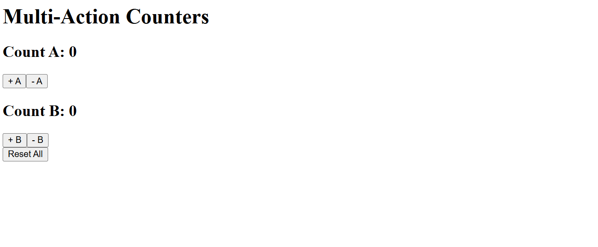

  ## React JS Exercise 13
  
  ***
  
  ## Developer Name: Eng Abdirahman Ai
  
  ***
  
  ## Group A
  
  ***
  
  [GitHub Link](https://github.com/engai2025/React-Exercise-12)
  
  ***
  
  ## Code
  
  ### App.jsx
  
  ```jsx
  
 import Exercise from "./Exercise-13";
 function App(){
   return (
    <>
 
      <Exercise />
    </>
   )
 }
 export default App;
  ```
  
  ### Exercise-13.jsx
  
  ```jsx
  // Exercise-13.jsx code
 
      import { useReducer } from "react";

 
const initialState = {
    Increment_A: 0, 
    Increment_B: 0 
};

 
const reducer = (state, action) => {
    switch (action.type) {
        
    
        case "INCREMENT_A": 
           return { ...state, Increment_A: state.Increment_A + 1 };
           
               
        
        case "DECREMENT_A":
            return { ...state, Increment_A: state.Increment_A > 0 ? state.Increment_A - 1 : 0 };
               
        
           
    
        case "INCREMENT_B":
            return { ...state, Increment_B: state.Increment_B + 1 };
             
         
        case "DECREMENT_B":
            return { ...state, Increment_B: state.Increment_B > 0 ? state.Increment_B - 1 : 0 };

        case "RESET_ALL":
            return initialState;

        default:
            return state;
    }
};

const Exercise = () => {
    const [state, dispatch] = useReducer(reducer, initialState);
    
    return (
        <>
            <h1>Multi-Action Counters</h1>
      
 
            <h2>Count A: {state.Increment_A}</h2>
            <button onClick={() => dispatch({ type: "INCREMENT_A" })}>
                + A
            </button>
            <button onClick={() => dispatch({ type: "DECREMENT_A" })}>
                - A
            </button>
            
          
          
            <h2>Count B: {state.Increment_B}</h2>
            <button onClick={() => dispatch({ type: "INCREMENT_B" })}>
                + B
            </button>
            <button onClick={() => dispatch({ type: "DECREMENT_B" })}>
                - B
            </button>
            
     

         <br />
            <button onClick={() => dispatch({ type: "RESET_ALL" })}>
                Reset All
            </button>
        </>
    );
};

export default Exercise;


  ```
  
   
  
   
  
  ## Output 1
  
  ***
 
  
  
  <!-- ## Output 2 -->
  
  
  <!--  -->

 
 
  
  ***
  
  ## Programming Language Used
  
  ***
  
  | Programming Language | Framework | Database |
  |:--------------------|:----------|:---------|
  | React JS            | 0         | 0        |
  
  ***
  
  ## Task
  
  - [x] Done
  
  